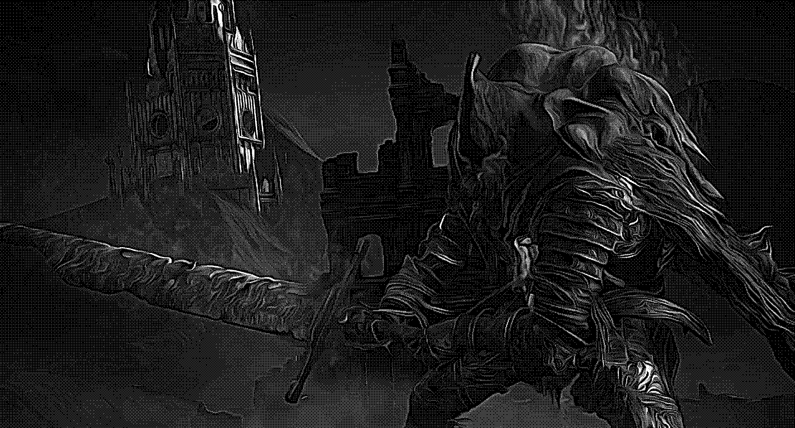
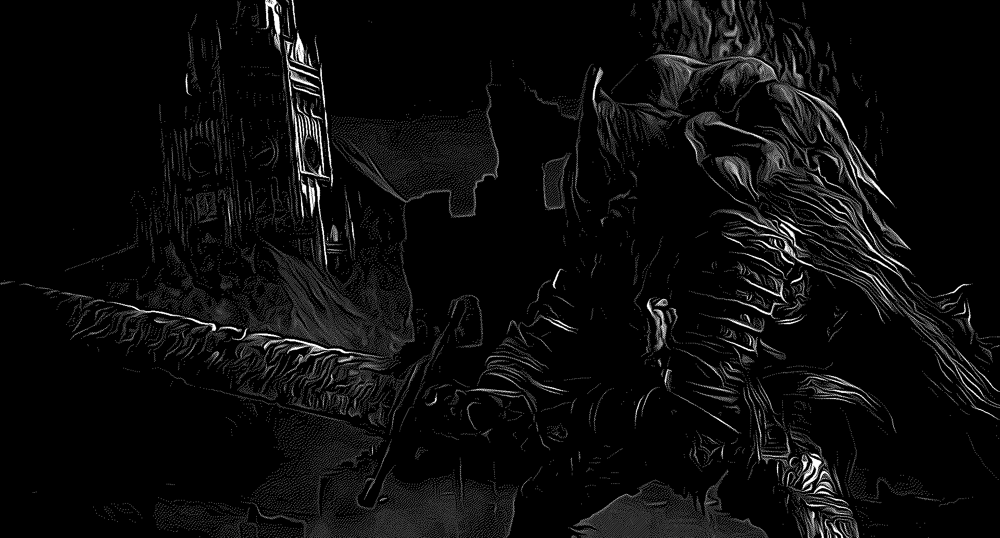
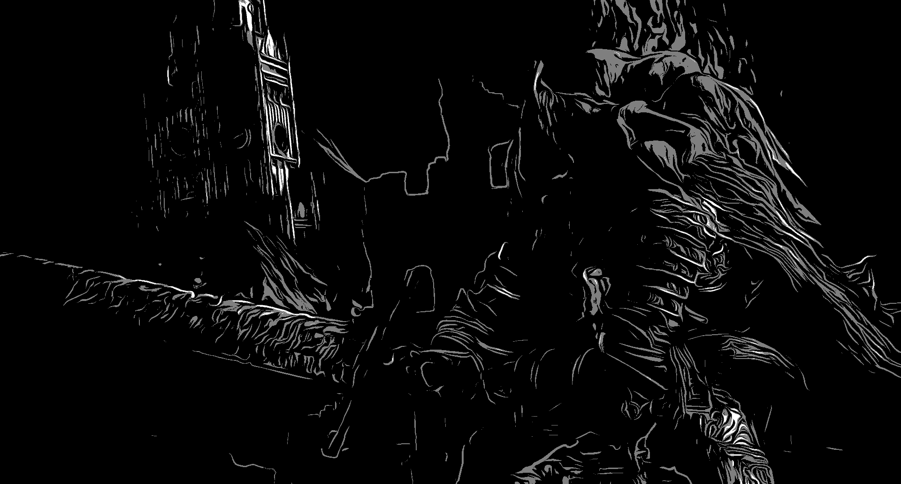
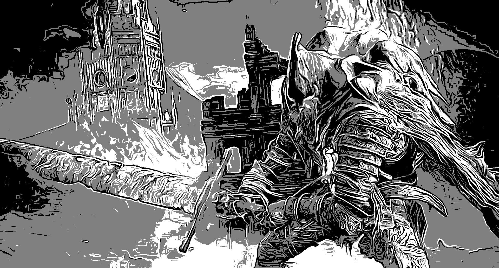

# DitherQuantizer

This project is a Java Maven application built with NetBeans IDE and Swing that applies a variety of **dithering** and **color quantization** methods to PNG/JPG/JPEG images, with options for color levels, processing scale, grayscale conversion, and dynamic range.

  
  

  
  

## Features

- **Multiple Dithering Algorithms**
  - Ordered Dithering: Bayer 8×8 (Which is calculted during runtime)
  - Diffusion Dithering: Floyd–Steinberg, Jarvis–Judice–Ninke (JJN), Stucki, Atkinson, Burkes, Sierra
- **Simple Quantization**: reduces color levels without dithering
- **Adjustable Color Levels**: from 2 up to 256
- **Processing Scale**: down and up scaling factor (1 to 5)
- **Grayscale Mode**: convert image to gray before processing
- **Dynamic Range Toggle**: enable or disable dynamic range in quantization
- **Drag & Drop UI**: process multiple images at once by dragging PNG/JPG/JPEG files
- **Live Preview** before saving
- **Automatic Naming** of output based on chosen parameters
